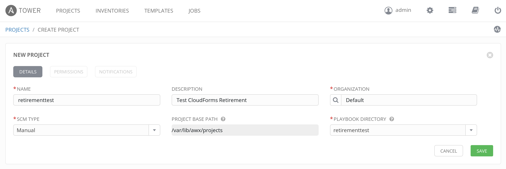
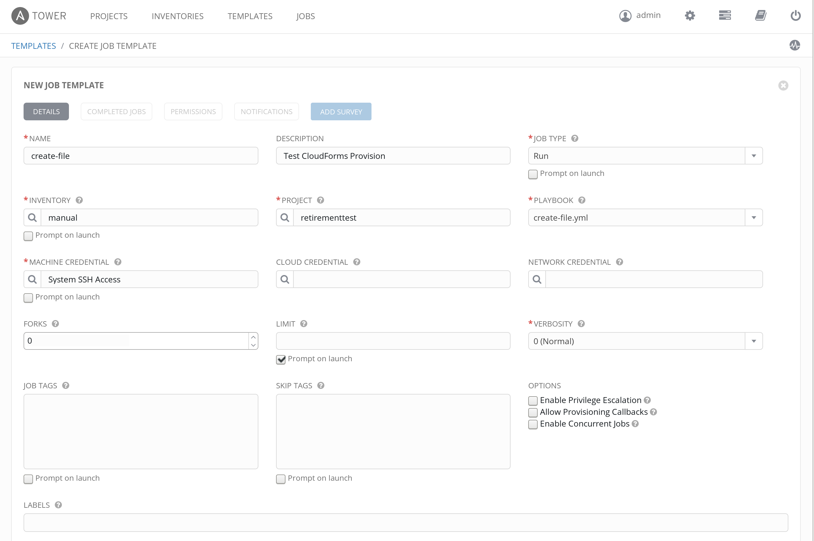
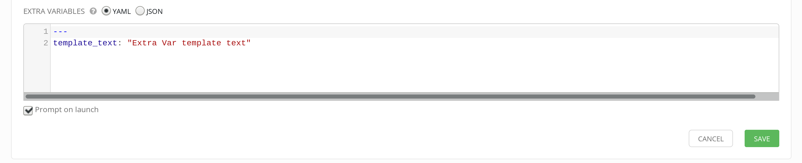
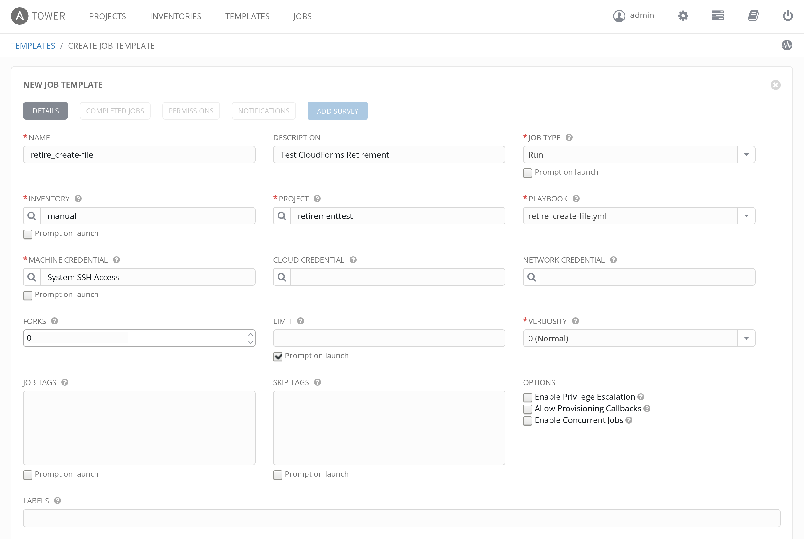
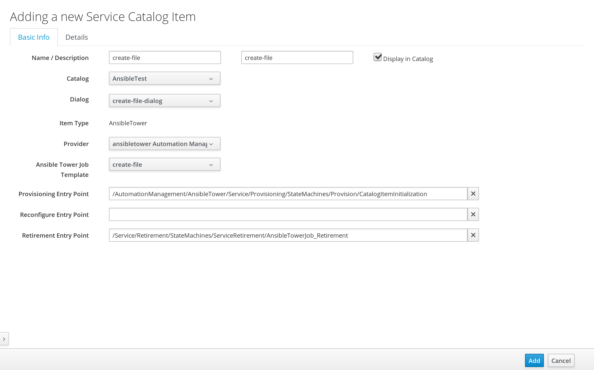

# AnsibleTower Service Retirement in CloudForms
Ansible itself doesn't have the concept of backing out or retiring a playbook.  You have to create an 'opposite' playbook to undo the steps of the main playbook.  This document walks through running a playbook on retirement of an AnsibleTower service.  It assumes you already have a CloudForms 4.5 install connected to an Ansible Tower provider.  It also assumes you have a running machine in inventory to test a playbook against.  

Note these steps are tested on CloudForms 4.5.  I've done similar previously on 4.1/4.2, but not with this same code.  

## Retiring an 'AnsibleTower' service with no backout
First, you will notice if you have an AnsibleTower service without a retirement entrypoint, the retirement will fail.  In order to get an AnsibleTower job to retire without error, use the `/Service/Retirement/StateMachines/ServiceRetirement/Generic` entrypoint.  This will basically just start retirement and finish retirement without actually taking any retirement steps.  

## Retiring an 'AnsibleTower' service with running a backout playbook

There are a number of steps to walk through to test playbook retirement.  We will walk through these as follows: 
* Create a provision and retire example job template in tower for testing
* Create methods in Automate to enable lauching a job on retirement 
* Create methods in Automate to enable checking job success on retirement 
* Create a retire service State Machine to call these custom methods
* Create and test provisioning and retiring an AnsibleTower service catalog item

### Create a provision and retire example job template in Ansible Tower for testing
For this we are going to simply do a manual project.  Follow the steps below to create your test project playbooks.  The playbook simply templates a file on provision and deletes the file on retirement.  It also uses a variable in the template to confirm variables are passing.  

Feel free to use other playbooks if you have them available and validated already.  The naming of the playbooks is important.  Cloudforms is going to look for the prefix 'retire\_' in front of the main playbook name when it runs retirement.  So if your main playbook is called 'create-file.yml', your retirement playbook should be called 'retire\_create-file.yml'.  This prefix could be changed in the code if desired.  

```
ssh root@<youransibletower>
cd /var/lib/awx/projects
mkdir retirementtest
cd retirementtest
mkdir templates 
cat << EOF > create-file.yml
---
# This playbook Creates a file (for testing retirement from CF)

- name: Deploy Test file
  hosts: all
  vars: 
    template_text: "Default template text"
  tasks:
  - name: Place temp file 
    template: src=hello.txt.j2 dest=/tmp/hello.txt owner=root group=root
EOF

cat << EOF > templates/hello.txt.j2
This is a test file used to test an ansible playbook on provision and retirement in CloudForms
Template test is < {{ template_text }} >
EOF

cat << EOF > retire_create-file.yml
---
# This playbook removes a file (for testing retirement from CF)

- name: Remove file 
  hosts: all
  tasks:
  - name: Place temp file 
    file: path=/tmp/hello.txt state=absent
EOF

cd /var/lib/awx/projects
chown -R awx:awx retirementtest

```

Now, log into your ansible tower Web UI.  On the Projects tab, click 'Add +'.  Create your new project to look like below and click 'Save'



Next we will create our provisioning job template.  Go to the Templates tab and click 'Add +' and select 'Job Template'.  Fill in the form similar to below and click 'Save'.  Note your inventory and machine credentials may be different than mine, but you need an inventory with a running rhel system to test on.  Also, it is important to note, under both limit and extra variables, prompt on launch MUST be checked.  Otherwise, CloudForms cannot pass data to override these.  Also, please ensure you have a template text line in your extra vars as shown in the pictures below.  




Repeat this process for our retirement job template.  NOTE that the name must be the same as the original template, but with 'retire\_' as a prefix.




At this point you can optionally run these job templates just to make certain both can execute properly.  That way you verify they are functional in Ansible Tower before layering on CloudForms. 

### Import Automate Methods 
There are a few methods needed in order to enable running a playbook on retirement.  These include the following: 

* ansible\_retire\_service:  This method is a modification of the /AutomationManagement/AnsibleTower/Service/Provisioning/StateMachines/Provision/provision method.  This finds the job template specified from the original service provision, and searches for a job template with the same name prefixed with 'retire\_'.  If found, it will launch that job with the same limit and extra vars from the initial service provision.  

* wait\_for\_completion: This method is a modification of AutomationManagement/AnsibleTower/Operations/StateMachines/Job/wait\_for\_completion.  Basically it just checks that the job we lauched completed successfully.  

* AnsibleTowerJob\_Retirement: This state machine is a copy of /Service/Retirement/StateMachines/ServiceRetirement/Default, but changing RetireService and CheckServiceRetires states to point to the 2 custom methods we created.  

You can import these as follows: 
```
ssh root@<cloudforms appliance>

curl -O https://raw.githubusercontent.com/jonjozwiak/cloudforms-ansibletower-retirement/master/ansible/import.yml
ansible-playbook -v import.yml
```

### Test provisioning and retiring an AnsibleTower service catalog item
Log into the CloudForms UI.  First go to Automation -> Automate -> Explorer.  Find the domain you imported and ensure it is enabled.  

Next, Go to Automation -> AnsibleTower -> Explorer.  On the 'Job Templates' accordion, select your create-file template.  You may need to refresh your provider if it's not there yet.  Click 'Configuration' -> Create Service Dialog from this template.  Call your service dialog 'create-file-dialog' and click save.  

Go to Automation -> Automate -> Customization and select the 'Service Dialogs' accordion.  Select the 'create-file-dialog' you just created and then do 'Configuration' -> 'Edit this Dialog'.  Select template_text and change the 'Read only' option so it is NOT checked.  

Now we want to create our service.  Go to 'Services' -> 'Catalogs'.  Click on the 'Catalogs' accordion.  Click 'Configuration' -> 'Add a new Catalog'.  Call it 'AnsibleTest' and click save.  

Next, click on the 'Catalog Items' accordion, highlight 'AnsibleTest', and click 'Configuration' -> 'Add a new Catalog Item'.  Select 'AnsibleTower' and then fill in the form as shown below and then click 'Add': 



Now click on the 'Service Catalogs' accordion, select create-file and click Order.  

For limit, specify your host name to run against as it is shown in inventory.  
For template_text, put in something like 'CloudForms Provisioning and Retirement Test'
Click Submit! 

Once finished, you can verify by looking in Tower at the job run.  (You should see the limit and template text passed through).  You can also look at the server in your inventory.  The template file is written to /tmp/hello.txt.  

Now you can run retirement and verify the file is removed.  Go to 'Services' -> 'My Services', select your create-file service, and click 'Lifecycle' -> 'Retire selected items'

Again, you can check in both your Tower job run (confirming limit and template text passed to extra vars) as well as confirming /tmp/hello.txt no longer exists on the server. 

